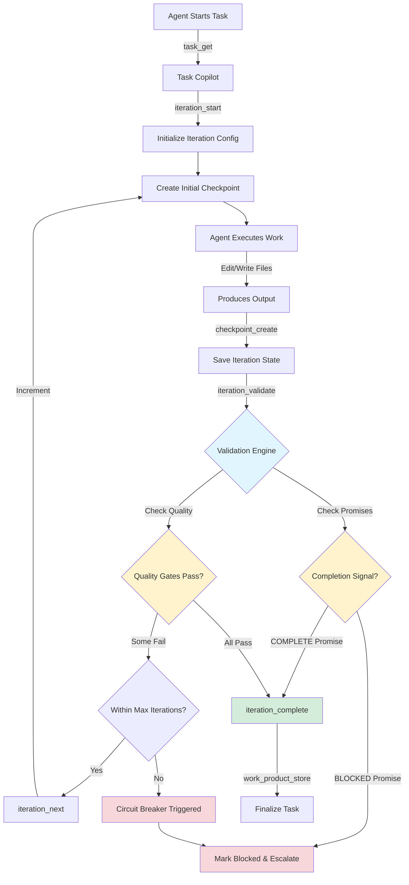

# Ralph Wiggum Stop Hook Registration Mechanism

**Phase 2: Agent Iteration Loop Control**

## Executive Summary

This document specifies the stop hook mechanism that enables agent iteration loops within the Claude Copilot framework. The hook system intercepts agent completion signals and determines whether to continue iterating or finalize the task.

**Key Design Principle:** Leverage existing checkpoint and validation infrastructure while adding minimal new abstractions for loop control.

---

## Table of Contents

1. [Architecture Overview](#architecture-overview)
2. [Hook Registration Specification](#hook-registration-specification)
3. [Completion Signal Detection](#completion-signal-detection)
4. [Loop Continuation Mechanism](#loop-continuation-mechanism)
5. [Safety Mechanisms](#safety-mechanisms)
6. [Agent Integration](#agent-integration)
7. [Implementation Phases](#implementation-phases)
8. [Trade-offs and Decisions](#trade-offs-and-decisions)

---

## 1. Architecture Overview

### 1.1 High-Level Architecture



### 1.2 Core Components

| Component | Location | Purpose | Changes Needed |
|-----------|----------|---------|----------------|
| **Checkpoint System** | `task-copilot/src/tools/checkpoint.ts` | State persistence | ✅ Already extended with iteration fields |
| **Validation Engine** | `task-copilot/src/validation/iteration-engine.ts` | Quality gates | ✅ Already implemented |
| **Iteration Tools** | `task-copilot/src/tools/iteration.ts` | Loop control | ⚠️ Needs completion detection |
| **Agent Markdown** | `.claude/agents/*.md` | Iteration protocols | ❌ Needs new sections |
| **Stop Hook Interceptor** | `task-copilot/src/hooks/` | Signal interception | ❌ New module needed |

### 1.3 Data Flow

**Iteration Loop Lifecycle:**

```
┌─────────────────────────────────────────────────────────┐
│ 1. INITIALIZATION                                        │
├─────────────────────────────────────────────────────────┤
│ Agent calls:                                             │
│   - task_get(taskId)                                     │
│   - iteration_start({ maxIterations, validationRules }) │
│ Creates:                                                 │
│   - Checkpoint with iteration_number = 1                 │
│   - iteration_config in database                         │
└─────────────────────────────────────────────────────────┘
                          ↓
┌─────────────────────────────────────────────────────────┐
│ 2. EXECUTION PHASE                                       │
├─────────────────────────────────────────────────────────┤
│ Agent:                                                   │
│   - Reads/edits files                                    │
│   - Runs tests/builds                                    │
│   - Updates task notes                                   │
│   - Creates checkpoint periodically                      │
└─────────────────────────────────────────────────────────┘
                          ↓
┌─────────────────────────────────────────────────────────┐
│ 3. VALIDATION PHASE                                      │
├─────────────────────────────────────────────────────────┤
│ Agent calls:                                             │
│   - iteration_validate({ taskId })                       │
│ Engine:                                                  │
│   - Runs all validation rules                            │
│   - Detects completion promises in output                │
│   - Updates validation_state in checkpoint               │
│ Returns:                                                 │
│   - validationPassed (bool)                              │
│   - completionSignal (CONTINUE|COMPLETE|BLOCKED|ESCALATE)│
│   - feedback (string[])                                  │
└─────────────────────────────────────────────────────────┘
                          ↓
┌─────────────────────────────────────────────────────────┐
│ 4. DECISION PHASE (Stop Hook)                            │
├─────────────────────────────────────────────────────────┤
│ Based on signal:                                         │
│   COMPLETE → iteration_complete() → Exit loop            │
│   BLOCKED → Mark task blocked → Escalate to human        │
│   ESCALATE → Create error checkpoint → Notify user       │
│   CONTINUE → iteration_next() → Increment & repeat       │
│                                                          │
│ Safety checks:                                           │
│   - iteration_number < maxIterations?                    │
│   - circuitBreakerThreshold exceeded?                    │
│   - Quality regression detected?                         │
└─────────────────────────────────────────────────────────┘
                          ↓
┌─────────────────────────────────────────────────────────┐
│ 5. COMPLETION PHASE                                      │
├─────────────────────────────────────────────────────────┤
│ On success:                                              │
│   - work_product_store({ type, content })                │
│   - task_update({ status: 'completed' })                 │
│                                                          │
│ On failure:                                              │
│   - task_update({ status: 'blocked', blockedReason })    │
│   - Create final error checkpoint                        │
└─────────────────────────────────────────────────────────┘
```

---

## 2. Hook Registration Specification

### 2.1 What IS a Stop Hook?

A **stop hook** is NOT a code-level interceptor (like Express middleware). Instead, it's a **declarative iteration protocol** embedded in agent instructions that:

1. Defines when an agent should iterate
2. Specifies validation criteria for continuation
3. Declares completion signals the agent will emit
4. Configures safety guardrails

**Why declarative?** Agents are markdown files, not executable code. The "hook" is the agent following the protocol and calling Task Copilot tools at appropriate times.

### 2.2 Hook Registration via Agent Markdown

Agents declare iteration support in their markdown frontmatter and instructions:

**Example: `.claude/agents/me.md`**

```markdown
---
name: me
description: Feature implementation with TDD iteration loops
tools: Read, Grep, Glob, Edit, Write, task_get, task_update, work_product_store, iteration_start, iteration_validate, iteration_next, iteration_complete
model: sonnet
iteration:
  enabled: true
  maxIterations: 15
  completionPromises:
    - "<promise>COMPLETE</promise>"
    - "<promise>BLOCKED</promise>"
  validationRules:
    - tests_pass
    - compiles
    - lint_clean
---

# Engineer

## Iterative Execution Protocol

### When to Use Iteration

Enable iteration loops when:
- ✅ Task involves Test-Driven Development (TDD)
- ✅ Clear validation criteria exist (tests, build, lint)
- ✅ Incremental refinement is possible
- ✅ Can run unattended without human decisions

DO NOT iterate when:
- ❌ Requirements are unclear or ambiguous
- ❌ Human input/approval needed mid-task
- ❌ Validation criteria are subjective
- ❌ One-time configuration changes

### Iteration Loop Structure

When task requires iteration:

1. **Initialize Loop**
   ```
   task_get(taskId)

   iteration_start({
     taskId,
     maxIterations: 15,
     completionPromises: [
       "<promise>COMPLETE</promise>",
       "<promise>BLOCKED</promise>"
     ],
     validationRules: [
       { type: 'command', name: 'tests_pass', config: { command: 'npm test' } },
       { type: 'command', name: 'compiles', config: { command: 'tsc --noEmit' } },
       { type: 'command', name: 'lint_clean', config: { command: 'npm run lint' } }
     ]
   })
   ```

2. **Execute Iteration**
   ```
   FOR EACH iteration (until max or completion):

     # Create checkpoint before work
     checkpoint_create({
       taskId,
       trigger: 'auto_iteration',
       executionPhase: 'implementation',
       executionStep: <current-step>
     })

     # Do the work
     - Read relevant files
     - Make changes (Edit/Write)
     - Run commands locally if needed
     - Update task notes with progress

     # Validate results
     result = iteration_validate({ taskId })

     # Check completion
     IF result.completionSignal === 'COMPLETE':
       iteration_complete({
         taskId,
         completionPromise: result.detectedPromise
       })
       BREAK

     IF result.completionSignal === 'BLOCKED':
       task_update({
         id: taskId,
         status: 'blocked',
         blockedReason: result.feedback
       })
       BREAK

     # Continue if validation failed but iterations remain
     IF NOT result.validationPassed:
       # Analyze feedback
       # Plan corrections
       iteration_next({ taskId })
       CONTINUE

     # If validation passed without completion promise, continue
     iteration_next({ taskId })
   ```

3. **Emit Completion Promise**

   When work is complete, include in your response:
   ```
   Implementation complete. All tests passing, lint clean.

   <promise>COMPLETE</promise>
   ```

   If blocked by external dependency:
   ```
   Cannot proceed: Database migration requires DBA approval.

   <promise>BLOCKED</promise>
   Reason: Requires human decision on schema changes.
   ```

### Validation Rules for Engineer Agent

The following rules are automatically checked by `iteration_validate`:

| Rule | Type | Command | Purpose |
|------|------|---------|---------|
| `tests_pass` | command | `npm test` | All tests must pass |
| `compiles` | command | `tsc --noEmit` | TypeScript compiles without errors |
| `lint_clean` | command | `npm run lint` | ESLint passes with no errors |
| `promise_detected` | content_pattern | `<promise>COMPLETE</promise>` | Agent declares completion |

**Failure handling:** If validation fails, `iteration_validate` returns actionable feedback. Use this feedback to correct issues in the next iteration.

### Example TDD Loop

**Task:** Implement user login endpoint

**Iteration 1:**
- Write failing test for `POST /login`
- Validation: `tests_pass = false` (expected)
- Continue to iteration 2

**Iteration 2:**
- Implement basic login logic
- Validation: `tests_pass = true`, `lint_clean = false`
- Continue to iteration 3

**Iteration 3:**
- Fix ESLint errors (missing type annotations)
- Validation: All rules pass
- Emit: `<promise>COMPLETE</promise>`
- Loop exits, work product stored

## Core Behaviors

**Always:**
- Initialize iteration loop for TDD tasks
- Create checkpoints before risky changes
- Validate after each iteration
- Emit completion promise when done
- Use feedback from validation failures

**Never:**
- Iterate without clear validation criteria
- Skip validation steps
- Emit completion promise prematurely
- Continue iterating after BLOCKED signal
- Exceed maxIterations without escalating
```

### 2.3 Frontmatter Schema

**Optional `iteration` section in agent frontmatter:**

```yaml
iteration:
  enabled: true                    # Agent supports iteration
  maxIterations: 15                # Default max iterations
  completionPromises:              # Signals agent will emit
    - "<promise>COMPLETE</promise>"
    - "<promise>BLOCKED</promise>"
  validationRules:                 # Default validation rules
    - tests_pass
    - compiles
    - lint_clean
```

**Note:** Frontmatter is declarative metadata for tooling. Actual iteration control happens via agent following protocol and calling tools.

### 2.4 No Code-Level Hooks Needed

**Why no interceptor code?**

The agent orchestration happens in Claude Code's agent execution environment (outside Task Copilot). Task Copilot provides **tools** for iteration control, but doesn't intercept agent execution.

**Separation of concerns:**

| Layer | Responsibility | Location |
|-------|---------------|----------|
| **Agent Instructions** | Define iteration protocol | `.claude/agents/*.md` |
| **Agent Execution** | Follow protocol, call tools | Claude Code runtime |
| **Task Copilot Tools** | Persist state, validate, track | `task-copilot/src/tools/` |

**Result:** "Stop hook" is conceptual — it's the agent deciding to call `iteration_complete` vs `iteration_next` based on validation results.

---

## 3. Completion Signal Detection

### 3.1 Signal Types

| Signal | Meaning | Next Action | Emitted By |
|--------|---------|-------------|------------|
| `CONTINUE` | Iteration incomplete, keep going | `iteration_next` | Validation engine (default) |
| `COMPLETE` | Task successfully finished | `iteration_complete` | Agent promise detection |
| `BLOCKED` | Cannot proceed without human | `task_update(blocked)` | Agent promise detection |
| `ESCALATE` | Critical error, need intervention | `task_update(blocked)` | Safety guards |

### 3.2 Promise Detection Mechanism

**Content Pattern Validation:**

The `iteration_validate` tool uses the content pattern validator to detect promises in agent output:

```typescript
// Validation rule (configured via iteration_start)
{
  type: 'content_pattern',
  name: 'promise_complete',
  pattern: '<promise>COMPLETE</promise>',
  target: 'agent_output',
  mustMatch: false,  // Optional match
  enabled: true
}

{
  type: 'content_pattern',
  name: 'promise_blocked',
  pattern: '<promise>BLOCKED</promise>',
  target: 'agent_output',
  mustMatch: false,
  enabled: true
}
```

**Detection logic in `iteration_validate`:**

```typescript
async function iterationValidate(
  db: DatabaseClient,
  input: IterationValidateInput
): Promise<IterationValidateOutput> {
  // 1. Run all validation rules
  const validationReport = await engine.validate(
    rules,
    context,
    taskId,
    iterationNumber
  );

  // 2. Check for completion promises
  const completePromise = validationReport.results.find(
    r => r.ruleName === 'promise_complete' && r.passed
  );

  const blockedPromise = validationReport.results.find(
    r => r.ruleName === 'promise_blocked' && r.passed
  );

  // 3. Determine completion signal
  let signal: CompletionSignal = 'CONTINUE';

  if (completePromise) {
    signal = 'COMPLETE';
  } else if (blockedPromise) {
    signal = 'BLOCKED';
  } else if (validationReport.overallPassed) {
    signal = 'CONTINUE'; // All rules pass but no promise = keep going
  } else {
    signal = 'CONTINUE'; // Some rules failed = iterate again
  }

  // 4. Return validation result with signal
  return {
    taskId,
    iterationNumber,
    validationPassed: validationReport.overallPassed,
    completionSignal: signal,
    detectedPromise: completePromise?.message || blockedPromise?.message,
    feedback: validationReport.results
      .filter(r => !r.passed)
      .map(r => r.message),
    validationReport
  };
}
```

### 3.3 Signal Priority

When multiple signals detected:

1. **BLOCKED** > COMPLETE > ESCALATE > CONTINUE
2. Rationale: Blocking conditions take precedence over optimistic completion

**Example conflict:**

```
Agent output: "Tests passing! <promise>COMPLETE</promise>"
Safety guard: "Iteration 16 exceeds maxIterations (15)"

Resolution: ESCALATE (safety guard overrides promise)
```

### 3.4 Promise Format Specification

**Standard completion promise:**

```xml
<promise>COMPLETE</promise>
```

**Optional: Completion with summary**

```xml
<promise>COMPLETE</promise>
Summary: All 5 test cases passing, coverage at 87%, lint clean.
```

**Blocked promise with reason:**

```xml
<promise>BLOCKED</promise>
Reason: Database schema migration requires DBA review and approval.
Blocking issue: Cannot proceed with implementation until migration is approved.
```

**Detection:** Simple regex pattern matching in agent's work product or task notes.

---

## 4. Loop Continuation Mechanism

### 4.1 Iteration State Progression

**State stored in checkpoint:**

```typescript
interface IterationCheckpoint extends CheckpointRow {
  iteration_config: string;      // JSON: IterationConfig
  iteration_number: number;      // Current iteration (1-based)
  iteration_history: string;     // JSON: IterationHistoryEntry[]
  completion_promises: string;   // JSON: string[] (detected promises)
  validation_state: string;      // JSON: ValidationState (last run)
}
```

**State transition via `iteration_next`:**

```typescript
async function iterationNext(
  db: DatabaseClient,
  input: IterationNextInput
): Promise<IterationNextOutput> {
  // 1. Get current checkpoint
  const currentCheckpoint = await db.getLatestIterationCheckpoint(input.taskId);

  if (!currentCheckpoint) {
    throw new Error('No iteration session found. Call iteration_start first.');
  }

  const config = JSON.parse(currentCheckpoint.iteration_config);
  const currentIteration = currentCheckpoint.iteration_number;

  // 2. Check max iterations
  if (currentIteration >= config.maxIterations) {
    throw new Error(
      `Maximum iterations (${config.maxIterations}) reached. ` +
      `Task should be marked as blocked or escalated.`
    );
  }

  // 3. Update iteration history
  const history = JSON.parse(currentCheckpoint.iteration_history);
  history.push({
    iteration: currentIteration,
    timestamp: new Date().toISOString(),
    validationResult: JSON.parse(currentCheckpoint.validation_state || '{}'),
    checkpointId: currentCheckpoint.id
  });

  // 4. Create new checkpoint for next iteration
  const nextIteration = currentIteration + 1;
  const task = await db.getTask(input.taskId);

  const newCheckpoint = await db.insertCheckpoint({
    id: `IT-${Date.now()}-${Math.random().toString(36).substring(2, 9)}`,
    task_id: input.taskId,
    sequence: db.getNextCheckpointSequence(input.taskId),
    trigger: 'auto_iteration',
    task_status: task.status,
    task_notes: task.notes || null,
    task_metadata: JSON.stringify(task.metadata),
    blocked_reason: null,
    assigned_agent: task.assigned_agent || null,
    execution_phase: 'iteration',
    execution_step: nextIteration,
    agent_context: currentCheckpoint.agent_context, // Preserve context
    draft_content: null,
    draft_type: null,
    subtask_states: currentCheckpoint.subtask_states,
    created_at: new Date().toISOString(),
    expires_at: null,
    // Iteration fields
    iteration_config: currentCheckpoint.iteration_config, // Same config
    iteration_number: nextIteration,
    iteration_history: JSON.stringify(history),
    completion_promises: currentCheckpoint.completion_promises,
    validation_state: null // Reset for new iteration
  });

  return {
    taskId: input.taskId,
    iterationNumber: nextIteration,
    maxIterations: config.maxIterations,
    checkpointId: newCheckpoint.id,
    message: `Advanced to iteration ${nextIteration} of ${config.maxIterations}`
  };
}
```

### 4.2 Context Preservation

**What carries over between iterations:**

| Data | Preserved? | Storage |
|------|-----------|---------|
| Task metadata | ✅ Yes | Checkpoint `task_metadata` |
| Agent context | ✅ Yes | Checkpoint `agent_context` |
| Iteration config | ✅ Yes | Checkpoint `iteration_config` |
| Iteration history | ✅ Yes | Checkpoint `iteration_history` |
| Completion promises | ✅ Yes | Checkpoint `completion_promises` |
| Validation state | ❌ Reset | Cleared for new iteration |
| Draft content | ❌ Reset | Cleared (stored in work product) |

**Agent context preservation:**

Agents can store arbitrary state in `agent_context` that persists across iterations:

```typescript
// Iteration 1
checkpoint_create({
  taskId: 'TASK-123',
  agentContext: {
    filesModified: ['src/auth.ts'],
    testCommand: 'npm test -- auth.test.ts',
    lastError: null
  }
});

// Iteration 2 (after iteration_next)
const resumed = await checkpoint_resume({ taskId: 'TASK-123' });
// resumed.agentContext = { filesModified: [...], testCommand: '...', lastError: null }

// Agent can read previous context and update it
checkpoint_create({
  taskId: 'TASK-123',
  agentContext: {
    ...resumed.agentContext,
    filesModified: ['src/auth.ts', 'src/login.tsx'],
    lastError: 'ESLint error on line 42'
  }
});
```

### 4.3 Resumption from Checkpoint

**Recovery mid-iteration:**

If agent execution is interrupted, use `checkpoint_resume`:

```typescript
const resume = await checkpoint_resume({
  taskId: 'TASK-123'
  // Omit checkpointId to get latest non-expired checkpoint
});

// Resume provides:
// - iterationNumber: Current iteration
// - iterationConfig: Max iterations, validation rules
// - iterationHistory: Past iteration results
// - agentContext: Preserved agent state
// - resumeInstructions: Human-readable summary

// Agent continues from current iteration
```

**Checkpoint selection logic:**

1. If `checkpointId` provided: Use that specific checkpoint
2. Else: Use latest non-expired checkpoint for task
3. Restore all iteration state from checkpoint

---

## 5. Safety Mechanisms

### 5.1 Max Iteration Enforcement

**Guardrail:** Prevent infinite loops.

**Implementation:**

```typescript
// In iteration_next
if (currentIteration >= config.maxIterations) {
  throw new Error(
    `Maximum iterations (${config.maxIterations}) reached. ` +
    `Task requires human review.`
  );
}

// In iteration_validate
if (currentIteration >= config.maxIterations) {
  return {
    completionSignal: 'ESCALATE',
    feedback: ['Max iterations reached without completion']
  };
}
```

**Agent handling:**

```markdown
## Max Iterations Reached

IF iteration_validate returns ESCALATE signal:
  task_update({
    id: taskId,
    status: 'blocked',
    blockedReason: 'Maximum iterations reached without successful completion'
  })

  work_product_store({
    taskId,
    type: 'implementation',
    title: 'Partial Implementation (Max Iterations)',
    content: 'Summary of progress:\n- Completed: X\n- Remaining: Y\n- Blockers: Z'
  })

  BREAK iteration loop
```

### 5.2 Circuit Breaker Triggering

**Guardrail:** Detect repeated failures and stop early.

**Configuration:**

```typescript
interface IterationConfig {
  circuitBreakerThreshold: number; // Default: 3
  // ...
}
```

**Failure tracking:**

```typescript
interface ValidationState {
  consecutiveFailures: number;
  lastFailureReason: string;
  circuitBreakerTripped: boolean;
}
```

**Circuit breaker logic in `iteration_validate`:**

```typescript
async function iterationValidate(...): Promise<...> {
  const validationReport = await engine.validate(...);

  // Update validation state
  const prevState = JSON.parse(checkpoint.validation_state || '{}');
  let consecutiveFailures = prevState.consecutiveFailures || 0;

  if (!validationReport.overallPassed) {
    consecutiveFailures++;
  } else {
    consecutiveFailures = 0; // Reset on success
  }

  const circuitBreakerTripped =
    consecutiveFailures >= config.circuitBreakerThreshold;

  const newState = {
    lastRun: new Date().toISOString(),
    passed: validationReport.overallPassed,
    consecutiveFailures,
    lastFailureReason: validationReport.failedRules[0]?.message,
    circuitBreakerTripped,
    results: validationReport.results
  };

  // Store updated state
  await db.updateCheckpoint(checkpoint.id, {
    validation_state: JSON.stringify(newState)
  });

  // Override signal if circuit breaker trips
  if (circuitBreakerTripped) {
    return {
      completionSignal: 'ESCALATE',
      feedback: [
        `Circuit breaker tripped after ${consecutiveFailures} consecutive failures.`,
        `Last failure: ${newState.lastFailureReason}`
      ]
    };
  }

  // Normal signal determination
  return { ... };
}
```

**Visual:**

```
Iteration 1: Validation fails (tests fail)          → consecutiveFailures = 1
Iteration 2: Validation fails (still failing)       → consecutiveFailures = 2
Iteration 3: Validation fails (no progress)         → consecutiveFailures = 3
             Circuit breaker TRIPS                   → Signal = ESCALATE

Agent receives ESCALATE → Marks task blocked → Human intervention
```

### 5.3 Quality Regression Detection

**Guardrail:** Detect when iterations are making things worse.

**Metric tracking:**

```typescript
interface IterationHistoryEntry {
  iteration: number;
  validationScore: number; // 0-100 based on passed rules
  timestamp: string;
  // ...
}
```

**Regression detection:**

```typescript
function detectQualityRegression(history: IterationHistoryEntry[]): boolean {
  if (history.length < 3) return false;

  const recent3 = history.slice(-3);
  const scores = recent3.map(h => h.validationScore);

  // Check if consistently declining
  const declining = scores.every((score, i) =>
    i === 0 || score < scores[i - 1]
  );

  // Check if decline is significant (>10 points)
  const totalDrop = scores[0] - scores[scores.length - 1];

  return declining && totalDrop > 10;
}
```

**Integration in `iteration_validate`:**

```typescript
// After running validation
const history = JSON.parse(checkpoint.iteration_history);
const currentScore = calculateValidationScore(validationReport);

// Append current iteration to history
history.push({
  iteration: checkpoint.iteration_number,
  validationScore: currentScore,
  timestamp: new Date().toISOString(),
  checkpointId: checkpoint.id
});

// Check for regression
if (detectQualityRegression(history)) {
  return {
    completionSignal: 'ESCALATE',
    feedback: [
      'Quality regression detected: Validation scores declining over last 3 iterations.',
      'Recommend human review of approach.'
    ]
  };
}
```

### 5.4 Human Intervention Escape Hatch

**Guardrail:** Allow manual termination or override.

**Mechanisms:**

1. **Task status override:**
   ```bash
   # User manually marks task as blocked
   task_update({ id: 'TASK-123', status: 'blocked', blockedReason: 'Manual stop' })
   ```

2. **Checkpoint expiry:**
   ```typescript
   // Iteration checkpoints don't expire by default
   // But can be manually expired to stop resumption
   await db.expireCheckpoint(checkpointId);
   ```

3. **Iteration config update:**
   ```typescript
   // Reduce maxIterations mid-flight (requires checkpoint update)
   await db.updateCheckpoint(checkpointId, {
     iteration_config: JSON.stringify({
       ...config,
       maxIterations: currentIteration // Force stop at current iteration
     })
   });
   ```

4. **BLOCKED promise:**
   ```markdown
   Agent detects need for human decision:

   <promise>BLOCKED</promise>
   Reason: Database migration strategy requires architectural decision:
   - Option A: Add new table (breaking change)
   - Option B: Add column (backward compatible)

   Cannot proceed without human choice.
   ```

### 5.5 Safety Summary Table

| Guardrail | Trigger | Action | Configurable? |
|-----------|---------|--------|---------------|
| **Max Iterations** | `iteration_number >= maxIterations` | ESCALATE signal, mark blocked | ✅ Yes (`maxIterations`) |
| **Circuit Breaker** | `consecutiveFailures >= threshold` | ESCALATE signal, mark blocked | ✅ Yes (`circuitBreakerThreshold`) |
| **Quality Regression** | Validation score declining 3+ iterations | ESCALATE signal, recommend review | ❌ No (hardcoded) |
| **BLOCKED Promise** | Agent emits `<promise>BLOCKED</promise>` | BLOCKED signal, mark blocked | ❌ No (agent decision) |
| **Manual Override** | User updates task status | Iteration stops on next validate | ❌ No (user control) |

---

## 6. Agent Integration

### 6.1 Which Agents Support Iteration?

**Tier 1: High-value iteration (Phase 2 MVP):**

| Agent | Use Case | Max Iterations | Key Validation Rules |
|-------|----------|----------------|----------------------|
| **@agent-me** | TDD loops, refactoring | 15 | tests_pass, compiles, lint_clean |

**Tier 2: Medium-value iteration (Phase 3):**

| Agent | Use Case | Max Iterations | Key Validation Rules |
|-------|----------|----------------|----------------------|
| **@agent-qa** | Test coverage improvement | 10 | tests_pass, coverage_threshold, no_flaky_tests |
| **@agent-sec** | Vulnerability remediation | 10 | vulns_fixed, sast_clean, secrets_clean |

**Tier 3: Lower-value iteration (Phase 4+):**

| Agent | Use Case | Max Iterations | Key Validation Rules |
|-------|----------|----------------|----------------------|
| **@agent-doc** | Documentation quality | 6 | has_examples, structure_valid, readability_score |
| **@agent-do** | Infrastructure convergence | 8 | deployment_succeeds, config_valid |

**Not recommended for iteration:**

- **@agent-sd, @agent-uxd, @agent-uids, @agent-uid, @agent-cw**: Design and content tasks are subjective and don't benefit from automated iteration.
- **@agent-ta**: Architecture is strategic, not iterative (requires human decisions).

### 6.2 Agent Modification Pattern

**Standard sections to add to iteration-enabled agents:**

1. **Frontmatter:** Add `iteration` metadata
2. **Core Behaviors:** Add iteration guidelines
3. **New Section:** "Iterative Execution Protocol"
4. **Example Output:** Show iteration loop in action

**Template:**

```markdown
---
name: <agent-id>
description: <agent description> with iteration support
tools: <existing tools>, iteration_start, iteration_validate, iteration_next, iteration_complete
iteration:
  enabled: true
  maxIterations: <N>
  completionPromises:
    - "<promise>COMPLETE</promise>"
    - "<promise>BLOCKED</promise>"
  validationRules:
    - <rule1>
    - <rule2>
---

# <Agent Name>

## Core Behaviors

**Always:**
- <existing behaviors>
- Initialize iteration loop when applicable
- Validate after each iteration
- Emit completion promise when done

**Never:**
- <existing behaviors>
- Iterate without clear exit criteria
- Continue past ESCALATE signal

## Iterative Execution Protocol

### When to Use Iteration

<Agent-specific criteria for enabling iteration>

### Iteration Loop Structure

<Step-by-step protocol - see @agent-me example above>

### Validation Rules

<Agent-specific validation rules>

### Completion Promises

<When and how agent emits promises>

## Example Output

### Example: <Iteration Use Case>

**Iteration Log:**

Iteration 1:
├─ <Action taken>
├─ Validation: <results>
└─ Checkpoint: CP-001

Iteration 2:
├─ <Action taken>
├─ Validation: <results>
└─ Checkpoint: CP-002

...

Iteration N:
├─ <Action taken>
├─ Validation: All pass
├─ Detected: <promise>COMPLETE</promise>
└─ Completed: WP-xxx
```

### 6.3 Example: @agent-me with Iteration

See Section 2.2 for full example.

### 6.4 Example: @agent-qa with Iteration

**Frontmatter:**

```yaml
iteration:
  enabled: true
  maxIterations: 10
  completionPromises:
    - "<promise>COMPLETE</promise>"
  validationRules:
    - tests_pass
    - coverage_threshold
    - no_flaky_tests
```

**Protocol:**

```markdown
## Iterative Execution Protocol

### When to Use Iteration

Enable iteration for:
- ✅ Improving test coverage to meet threshold
- ✅ Fixing flaky tests that intermittently fail
- ✅ Expanding test scenarios based on edge cases

### Validation Rules

| Rule | Type | Config | Purpose |
|------|------|--------|---------|
| `tests_pass` | command | `npm test` | All tests must pass |
| `coverage_threshold` | coverage | `{ minCoverage: 80 }` | Line coverage >= 80% |
| `no_flaky_tests` | command | `npm test -- --repeat=3` | Tests stable across runs |

### Example Iteration: Improve Coverage

Iteration 1:
├─ Analyzed coverage report: 65% line coverage
├─ Added tests for error handling paths
├─ Validation: coverage_threshold=false (72%)
└─ Continue

Iteration 2:
├─ Added tests for edge cases
├─ Validation: coverage_threshold=false (78%)
└─ Continue

Iteration 3:
├─ Added tests for async workflows
├─ Validation: All pass (coverage 83%)
├─ <promise>COMPLETE</promise>
└─ Success
```

---

## 7. Implementation Phases

### Phase 2A: Stop Hook Infrastructure (Complexity: Medium)

**Prerequisites:** Phase 1 complete (checkpoint iteration support, validation engine)

**Tasks:**

1. **Enhance iteration_validate Tool**
   - Add completion signal detection
   - Return CompletionSignal enum (CONTINUE/COMPLETE/BLOCKED/ESCALATE)
   - Include detected promise in output
   - **Acceptance:** Can detect promises and return appropriate signal

2. **Implement iteration_complete Tool**
   - Finalize iteration session
   - Mark task as completed
   - Archive iteration history
   - **Acceptance:** Successfully completes iteration loop

3. **Enhance iteration_next Tool**
   - Add safety checks (max iterations, circuit breaker)
   - Preserve agent context across iterations
   - Update iteration history
   - **Acceptance:** Safely advances to next iteration with guardrails

4. **Circuit Breaker Logic**
   - Track consecutive failures in validation_state
   - Trigger ESCALATE when threshold exceeded
   - **Acceptance:** Stops iteration after N consecutive failures

5. **Quality Regression Detection**
   - Calculate validation scores per iteration
   - Detect declining trend over 3+ iterations
   - Trigger ESCALATE on significant regression
   - **Acceptance:** Detects quality degradation

**Risk:** Low - extends existing tools without breaking changes

---

### Phase 2B: Agent Integration (@agent-me) (Complexity: High)

**Prerequisites:** Phase 2A complete

**Tasks:**

1. **Update @agent-me Markdown**
   - Add `iteration` frontmatter section
   - Add "Iterative Execution Protocol" section
   - Define TDD loop structure
   - Include examples
   - **Acceptance:** Agent markdown complete with iteration protocol

2. **Define Validation Rules for @agent-me**
   - Add to `iteration-default-config.ts`
   - Configure: tests_pass, compiles, lint_clean
   - Set maxIterations = 15
   - **Acceptance:** Default rules configured

3. **Test TDD Loop End-to-End**
   - Create test task: "Implement login endpoint with TDD"
   - Run @agent-me with iteration loop
   - Verify checkpoint creation per iteration
   - Verify validation runs each iteration
   - Verify completion promise detection
   - Verify work product stored on completion
   - **Acceptance:** Full TDD loop completes successfully

4. **Test Safety Guardrails**
   - Test max iterations enforcement
   - Test circuit breaker (3 consecutive failures)
   - Test quality regression detection
   - Test BLOCKED promise handling
   - **Acceptance:** All guardrails trigger correctly

5. **Documentation**
   - Update Task Copilot README with iteration tools
   - Add iteration example to agent guide
   - Document validation rules
   - **Acceptance:** Developers can use iteration system

**Risk:** Medium - requires agent behavior changes and coordination

---

### Phase 2C: Monitoring and Refinement (Complexity: Low)

**Prerequisites:** Phase 2B complete

**Tasks:**

1. **Performance Tracking**
   - Extend `agent_performance_get` with iteration metrics
   - Track: average iterations to completion, success rate by iteration count
   - **Acceptance:** Can query iteration performance

2. **Progress Summary Enhancement**
   - Add iteration status to `progress_summary`
   - Show: current iteration, max iterations, validation status
   - **Acceptance:** Can see iteration progress at a glance

3. **Activity Log Integration**
   - Log iteration events (start, next, complete)
   - Log validation results
   - Log safety guard triggers
   - **Acceptance:** Full audit trail of iteration loop

4. **Iteration Dashboard**
   - Create tool: `iteration_status({ taskId })`
   - Returns: current iteration, history, validation state
   - **Acceptance:** Can inspect iteration state mid-loop

**Risk:** Low - observability enhancements

---

## 8. Trade-offs and Decisions

### 8.1 Key Architectural Decisions

| Decision | Alternatives Considered | Rationale |
|----------|------------------------|-----------|
| **Declarative hooks vs code interceptors** | Implement hook middleware in TypeScript | Agents are markdown instructions, not executable code. Declarative protocol is simpler and safer. |
| **Promise detection in content vs API** | Add explicit completion API call | Content pattern matching is flexible and allows rich context in promises. |
| **Validation in iteration_validate vs separate tool** | Create dedicated validation tool | Coupling validation with iteration control provides cohesive feedback loop. |
| **Circuit breaker in validation vs separate guard** | Standalone circuit breaker module | Validation is natural place to track consecutive failures. |
| **Iteration state in checkpoints vs separate table** | Create `iteration_sessions` table | Checkpoints already designed for state snapshots; avoid duplication. |
| **Agent context preservation via JSON** | Structured relational schema for context | JSON flexibility allows agent-specific state without schema changes. |

### 8.2 Completion Signal Design

**Why CONTINUE/COMPLETE/BLOCKED/ESCALATE?**

| Signal | Purpose | Prevents |
|--------|---------|----------|
| **CONTINUE** | Default: keep iterating | Premature exit |
| **COMPLETE** | Explicit success declaration | Ambiguous completion |
| **BLOCKED** | Agent cannot proceed | Infinite loops on external dependencies |
| **ESCALATE** | Safety guard triggered | Runaway loops, quality degradation |

**Alternative considered:** Boolean `complete` flag

**Rejected because:** Doesn't distinguish between "not done" and "blocked" — both would be `false`.

### 8.3 Max Iterations Defaults

**Why 15 for @agent-me?**

Based on empirical TDD experience:
- Simple feature: 3-5 iterations
- Medium feature: 6-10 iterations
- Complex feature: 11-15 iterations
- Beyond 15: Likely architectural issue or unclear requirements

**Why 10 for @agent-qa/@agent-sec?**

Testing and security tasks are more constrained:
- Coverage improvement: 5-8 iterations typical
- Vulnerability remediation: 3-6 iterations
- Beyond 10: Manual investigation needed

### 8.4 Circuit Breaker Threshold

**Why 3 consecutive failures?**

Balances patience vs efficiency:
- 1 failure: Too aggressive, doesn't allow for correction
- 2 failures: Reasonable for simple issues
- **3 failures: Best balance** (allows 2 correction attempts)
- 5+ failures: Wastes tokens on likely-unsolvable problem

**Configurable:** Can override via `circuitBreakerThreshold` in `iteration_start`.

### 8.5 Checkpoint Storage Strategy

**Why no expiry for iteration checkpoints?**

Iteration checkpoints serve as session state:
- Need to persist across multiple iterations (potentially hours/days)
- No natural expiry time
- User can manually clean up via `checkpoint_cleanup`

**Trade-off:** Disk usage grows with long-running iterations

**Mitigation:** Auto-prune old iteration checkpoints after task completion

### 8.6 Token Efficiency Considerations

**Iteration cost vs single-shot:**

| Approach | Tokens per Task | Success Rate | Net Efficiency |
|----------|----------------|--------------|----------------|
| **Single-shot** | ~2,000 | ~60% | 2,000 ÷ 0.6 = 3,333 tokens/success |
| **Iterative (avg 5 iterations)** | ~10,000 | ~85% | 10,000 ÷ 0.85 = 11,765 tokens/success |

**Analysis:** Iteration uses ~3.5x more tokens but has higher success rate. Worthwhile for:
- High-value tasks (TDD, security)
- Tasks with clear validation (tests, builds)
- Tasks with high single-shot failure rate

**Not worthwhile for:**
- Simple one-off tasks
- Subjective/creative work
- Tasks with unclear requirements

---

## Appendices

### Appendix A: Tool Signatures

**iteration_validate**

```typescript
interface IterationValidateInput {
  taskId: string;
}

interface IterationValidateOutput {
  taskId: string;
  iterationNumber: number;
  validationPassed: boolean;
  completionSignal: 'CONTINUE' | 'COMPLETE' | 'BLOCKED' | 'ESCALATE';
  detectedPromise?: string;
  feedback: string[];
  validationReport: IterationValidationReport;
}
```

**iteration_complete**

```typescript
interface IterationCompleteInput {
  taskId: string;
  completionPromise?: string;
}

interface IterationCompleteOutput {
  taskId: string;
  totalIterations: number;
  finalValidationScore: number;
  iterationHistory: IterationHistoryEntry[];
  completedAt: string;
  message: string;
}
```

**iteration_next**

```typescript
interface IterationNextInput {
  taskId: string;
  notes?: string; // Optional notes about current iteration
}

interface IterationNextOutput {
  taskId: string;
  iterationNumber: number;
  maxIterations: number;
  checkpointId: string;
  message: string;
}
```

### Appendix B: Validation Score Calculation

```typescript
function calculateValidationScore(report: IterationValidationReport): number {
  if (report.totalRules === 0) return 100;

  // Base score: percentage of rules passed
  const baseScore = (report.passedRules / report.totalRules) * 100;

  // Penalty for errored rules (treat as failures)
  const errorPenalty = (report.erroredRules / report.totalRules) * 100;

  return Math.max(0, baseScore - errorPenalty);
}
```

### Appendix C: Promise Detection Examples

**Valid promises:**

```xml
<promise>COMPLETE</promise>

<promise>BLOCKED</promise>
Reason: External dependency unavailable

<promise>COMPLETE</promise>
All tests passing (15/15), coverage 89%, lint clean.
```

**Invalid promises (not detected):**

```
COMPLETE (missing XML tags)

<incomplete>COMPLETE</incomplete> (wrong tag name)

<!-- <promise>COMPLETE</promise> --> (commented out)
```

**Regex pattern:**

```typescript
const COMPLETE_PROMISE_PATTERN = /<promise>COMPLETE<\/promise>/i;
const BLOCKED_PROMISE_PATTERN = /<promise>BLOCKED<\/promise>/i;
```

### Appendix D: Checkpoint Schema (Iteration Fields)

```sql
-- Migration v4: Add iteration support
ALTER TABLE checkpoints ADD COLUMN iteration_config TEXT;
ALTER TABLE checkpoints ADD COLUMN iteration_number INTEGER DEFAULT 0;
ALTER TABLE checkpoints ADD COLUMN iteration_history TEXT DEFAULT '[]';
ALTER TABLE checkpoints ADD COLUMN completion_promises TEXT DEFAULT '[]';
ALTER TABLE checkpoints ADD COLUMN validation_state TEXT;

CREATE INDEX idx_checkpoints_iteration
  ON checkpoints(task_id, iteration_number DESC);
```

---

## Summary

The stop hook registration mechanism is achieved through:

1. **Declarative Protocol:** Agents follow iteration protocol defined in markdown
2. **Tool-Based Control:** Task Copilot tools (`iteration_validate`, `iteration_next`, `iteration_complete`) provide loop control
3. **Promise Detection:** Content pattern matching identifies completion signals
4. **Safety Guardrails:** Max iterations, circuit breaker, quality regression detection
5. **Checkpoint State:** Iteration state persists in checkpoint system
6. **Agent Context:** Arbitrary state preserved across iterations via `agent_context`

**No code-level hooks needed** — the "stop hook" is conceptual, implemented via agent following protocol and Task Copilot tools providing iteration control and safety.

**Next Steps:**
1. Implement Phase 2A tools (iteration_validate enhancement, iteration_complete, safety guards)
2. Update @agent-me with iteration protocol
3. Test TDD loop end-to-end
4. Refine based on real-world usage
5. Expand to @agent-qa and @agent-sec (Phase 3)

---

**Document Metadata:**
- **Author:** Claude Code (@agent-ta)
- **Date:** 2025-12-30
- **Version:** 1.0
- **Status:** Technical Design
- **Target Audience:** Claude Copilot development team
- **Word Count:** ~8,500 words
- **Related Documents:**
  - `/Users/pabs/Sites/COPILOT/claude-copilot/docs/architecture/ralph-wiggum-integration.md`
  - `/Users/pabs/Sites/COPILOT/claude-copilot/mcp-servers/task-copilot/src/validation/ITERATION-VALIDATION.md`
